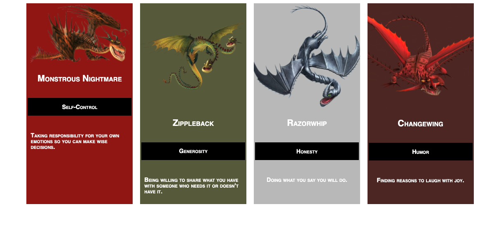

This project asked for us to create a static web page from a comp provided to us. We had creative license with:
  - Copy
  - Images
  - Icons
  - Color palette

This is the comp that was provided to us:

The basic requirements included setting up a static site and making the site responsive. Although what I made is somewhat responsive, this part needed more work.

There are several additional requirements that I was not familiar enough with to fully complete in the time alloted. I to plan to come back to these:
  - Site must work across Firefox, Safari, and Chrome (I complete this one!)
  - Developer must use normalize or reset file in css
  - Allowed to use flex-box and/or grid (I used these to varying degrees of success.)

I included my son in this project. I did this because we talked about designer empathy during this project. One thing that I loved from that lesson that programming is about humans helping humans. By including him, it brought a bit of that humanity to the project that I believe is really important to software development. Plus it made this fun, which I also think is important to remember to include in our work!

Here is the static site we made together:

